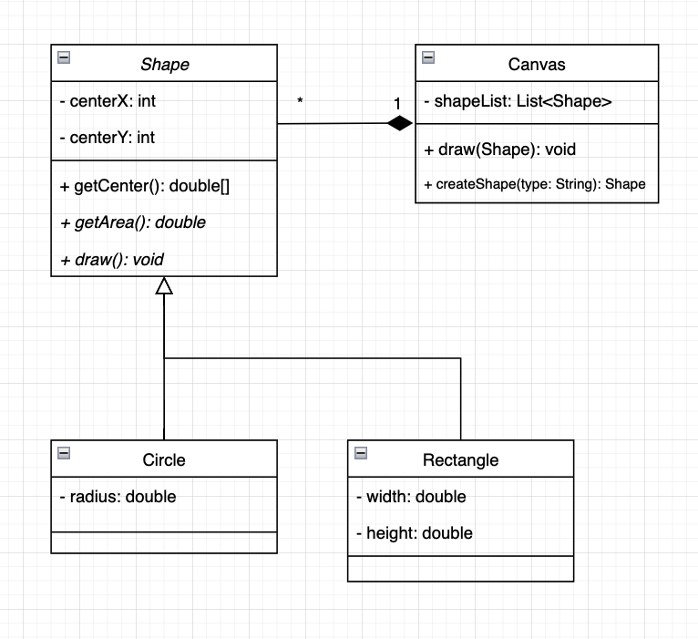

# Homework 2

Xinyu Liu

Jan 2022

## 1 
Class Diagram




## 2
In this case, `createShape()` is a factory method. Therefore, canvas class is using factory method pattern and canvas is acting as a concrete creator.

## 3
```java
public class Canvas{
    public List<Shape> shapeList;

    public Shape draw() {
        // String input = get user's choice of shape  e.g. circle
        Shape shape = createShape(input);
        // User may change some attributes of shape such as radius or style
        shape.draw();
        shapeList.add(shape);
    }

    public Shape createShape(String type) {
        if (shape == "circle") 
            return new Circle();
        else if (shape == "rectangle") 
            return new Rectangle();
    }
}
```

## 4
Scenario: assume that shape style cannot be changed after creation.

 We could have an abstract factory `ShapeFactory`, and it has subclass such as `FillShapeFactory`, `OutlineShapeFactory`, `ShadesShapeFactory`. In this case, the same style can be applied to all the shapes created by the same factory. Factory method does not have the ability to enforce creating different shapes that belong to the same families.

 ## 5
 For the project, I think we could use abstract factory method in enemy creation. Assume that the game has different difficulty levels, then the factories would create all enemies of same difficulty. In this case the code would look like 
 ```java
 public EasyEnemyFactory extends EnemyFactory {}
 public MediumEnemyFactory extends EnemyFactory {}
 public HardEnemyFactory extends EnemyFactory {}

EnemyFactory ef;
if (level == "easy")
    ef = new EasyEnemyFactory();
else if (level == "medium") 
    ef = new MediumEnemyFactory();
else
    ef = new HardEnemyFactory();

ef.createEnemy();
 ```