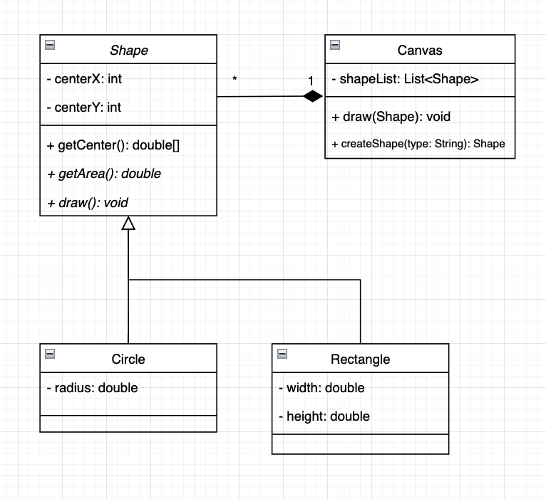

# Homework 1

Xinyu Liu

Jan 2022

## 1 
Class Diagram




## 2
In this case, `createShape()` is a factory method. Therefore, canvas class is using factory method pattern and canvas is acting as a concrete creator.

## 3
```java
public class Canvas{
    public List<Shape> shapeList;

    public Shape draw() {
        // String input = get user's choice of shape  e.g. circle
        Shape shape = createShape(input);
        // User may change some attributes of shape such as radius or style
        shape.draw();
        shapeList.add(shape);
    }

    public Shape createShape(String type) {
        if (shape == "circle") 
            return new Circle();
        else if (shape == "rectangle") 
            return new Rectangle();
    }
}
```