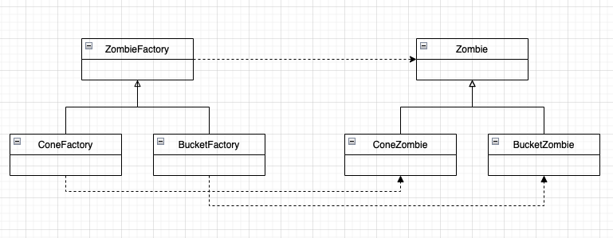

# Homework 3

Xinyu Liu

Feb 2022

## 1 
I think in this case we could use factory method. We could have a creator that also acts as a concrete creator `BaseFactory` that generates `BaseZombie`. Then we could have `ConeFactory` and `BucketFactory` as concrete creators inherit from `BaseFactory` and produce concrete products `ConeZombie` and `BucketZombie`. The reason why it's not abstract factory is because there is no family of `ConeZombie`.

## 2
Class Diagram



## 3
* ZombieFactory: Creator
* ConeFactory/BucketFactory: ConcreteCreator
* Zombie: Product
* ConeZombie/BucketZombie: ConcreteProduct

Upon creation, the game has `List<ZombieFactory>`. Inside this list, there could be `ConeFactory` or `BucketFactory`. Then  we simply run a `for` loop through the list. On each factory we call something like `zFactory.produce()` that produces a zombie of type corresponding to its factory type. Therefore when the zombie is produced, the game doesn't need to know what type it is.

## 4

I think we could use the builder pattern in Lesson 13. The `ZombieBuilder` can build a `Zombie` class by making different build calls. For example, if we want to get a `ConeZombie`, we could do the following:
```java
ZombieBuilder zb = new ZombieBuilder();
zb.buildBase(); //  Zombie has 50 hp
zb.buildCone(); // Cone grants additional 25hp
Zombie result = zb.getResult();
```