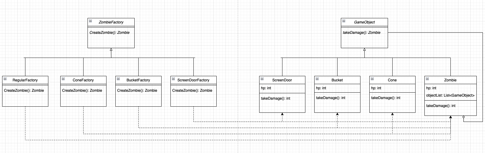

# Homework 4
Xinyu Liu

Mar 2022

## 1


## 2
The program is using factory method pattern + composite pattern.
| Pattern | Class |
| --- | ----------- |
| Factory | ZombieFactory |
| Concrete Factory | RegularFactory, ConeFactory, BucketFactory, ScreenDoorFactory |
| Product | Zombie |
| Concrete Product | RegularZombie, ConeZombie, BucketZombie, ScreenDoorZombie |

| Pattern | Class |
| --- | ----------- |
| Component | Zombie |
| Leaf | RegularZombie |
| Composite | ConeZombie, BucketZombie, ScreenDoorZombie |

## 3 & 4
In case IDE doesn't support the code, following are the UNIX commands needed to execute the program.
```bash
cd src/
javac Main.java
java Main
```

## 5
Modify `takeDamage(int damage)` to `takeDamage(String damageType, int damage)`. In `ScreenDoorZombie` class, if damage type is watermelon, then the damage is directly inflicted onto child zombie. If child zombie hp <= 0, then `ScreenDoorZombie` dies. 