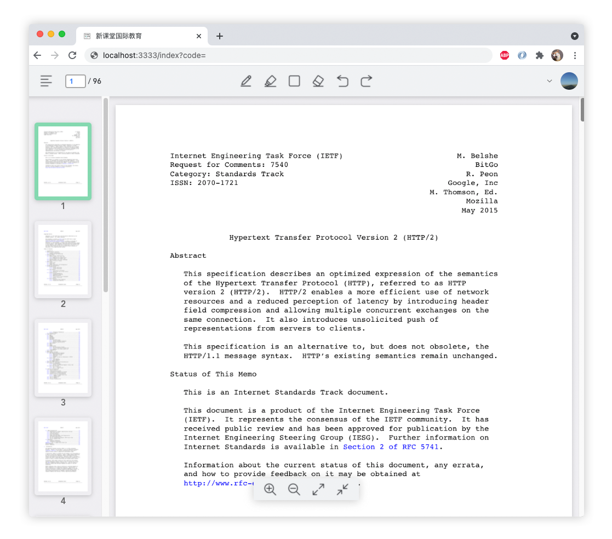

# Homework 5
Xinyu Liu

Mar 2022

## 1
### a
```java
/* The Command for turning on the light - ConcreteCommand #1 */ 
public class FlipUpCommand implements Command { 
    private Light theLight; 

    public FlipUpCommand(Light light) { 
        this.theLight = light; 
    } 

    @Override
    public void execute() {
        this.theLight.turnOn();
    }
}

/* The Command for turning off the light - ConcreteCommand #2 */ 
public class FlipDownCommand implements Command { 
    private Light theLight; 

    public FlipDownCommand(Light light) { 
        this.theLight = light; 
    } 
    
    @Override
    public void execute() {
        this.theLight.turnOff();
    }
} 
```

### b
```java
public class Test {
    public static void main(String[] args) {
        Light light = new Light();
        Switch s = new Switch();
        s.storeAndExecute(new FlipUpCommand(light));
        s.storeAndExecute(new FlipDownCommand(light));
    }
}
```

## 2

The project I choose is a pdf editor web (example shown below). It allows users to make edits on pdf files in web browser. The most important QA for this project is performance. Performance is important because bad performance will cause the website to crash, thus also affect availability. The problem comes from IOS devices' limit on `<canvas>` element memory size. To solve this problem we have to **manage resource** by **schedule resources**. Initially we had `<canvas>` element for every page. In order to reduce the total memory use, we dynamically load and unload `<canvas>` depending on whether it's shown on screen. Furthermore, we only allow the browser to zoom out to maximum of 3 pages in screen. Therefore, the maximum memory usage is only the size of 3 pages worth of memory. The performance of the website is improved by reducing memory usage from O(n) to O(1) where n is number of pages being scrolled.

