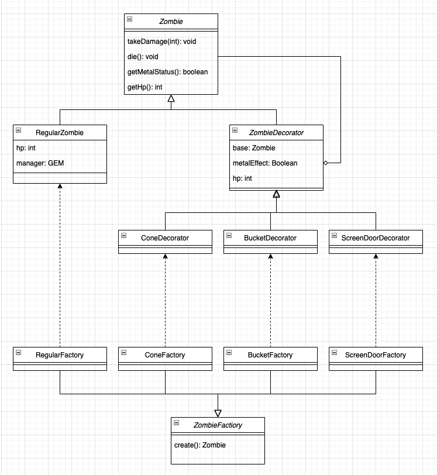

# Homework 6
Xinyu Liu

April 2022

## 1


## 2
In case IDE doesn't support the code, following are the UNIX commands needed to execute the program.
```bash
cd src/
javac Main.java
java Main
```
Please follow console prompt for correct input. This program cannot handle weird input.

## 3
