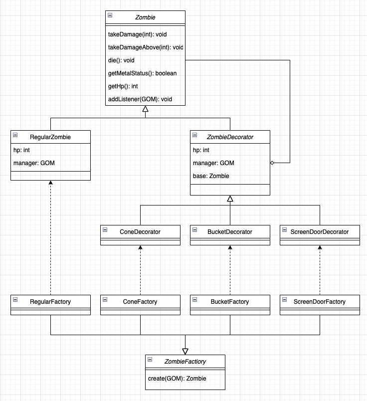

# Homework 6
Xinyu Liu

April 2022

## 1


## 2
In case IDE doesn't support the code, following are the UNIX commands needed to execute the program.
```bash
cd src/
javac Main.java
java Main
```
Please follow console prompt for correct input. This program cannot handle weird input.

## 3
I think for this example, decorator pattern works better. The zombie type can be determined by its class whereas for composite pattern, we have go into the composite's list to find what type it is. Also, it makes more sense to add accessories(decorator) on top of the regular zombie rather than keep both zombie and accessories in the same list. 